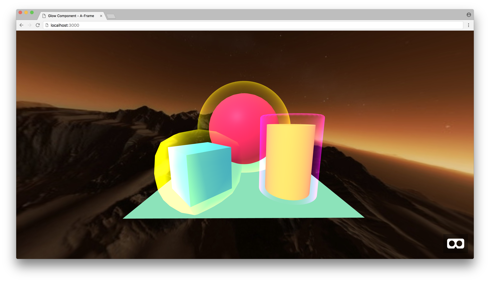

# A-Frame Glow Component

Glow component for [A-Frame](https://aframe.io) to add on your entities.

## Demo



#### [Live demo](https://etiennepinchon.github.io/aframe-glow/)

## Getting Started

```html
<a-entity glow></entity>
```

To turn it off:

```html
<a-entity glow="enabled:false"></entity>
```

Properties:

#### C (default: 1, min: 0, max: 1)

```html
<a-entity glow="c:0.3;"></entity>
```

#### P (default: 1.4, min: 0, max: 6)

```html
<a-entity glow="p:1.1;"></entity>
```

#### Color (default: #FFFF00)

```html
<a-entity glow="color: #FF00FF;"></entity>
```

#### Scale (default: 2)

Adjust the scale of the glow.

```html
<a-entity glow="scale: 1.3; color: #FF00FF;"></entity>
```

#### Side (default: front, values: front/back)

Change the type of glow.

```html
<a-entity glow="side: back; scale: 1.3; color: #FF00FF; c: 0.3; p: 3;"></entity>
```


## Want to make some changes to it?

### Installation

First make sure you have Node installed.

On Mac OS X, it's recommended to use [Homebrew](http://brew.sh/) to install Node + [npm](https://www.npmjs.com):

    brew install node

To install the Node dependencies:

    npm install


### Local Development

To serve the site from a simple Node development server:

    npm start

Then launch the site from your favourite browser:

[__http://localhost:3000/__](http://localhost:3000/)

If you wish to serve the site from a different port:

    PORT=8000 npm start


## Acknowledgement

Based on the work of @stemkoski for ThreeJS:
http://stemkoski.github.io/Three.js/Shader-Glow.html

## License

Distributed under an [MIT License](LICENSE).
